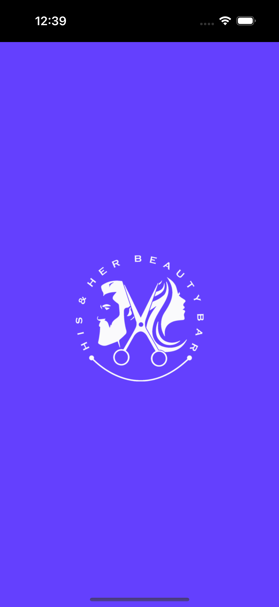
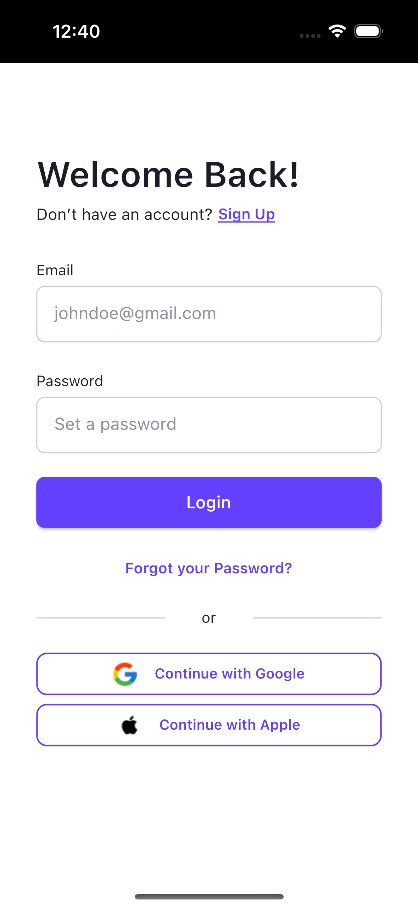
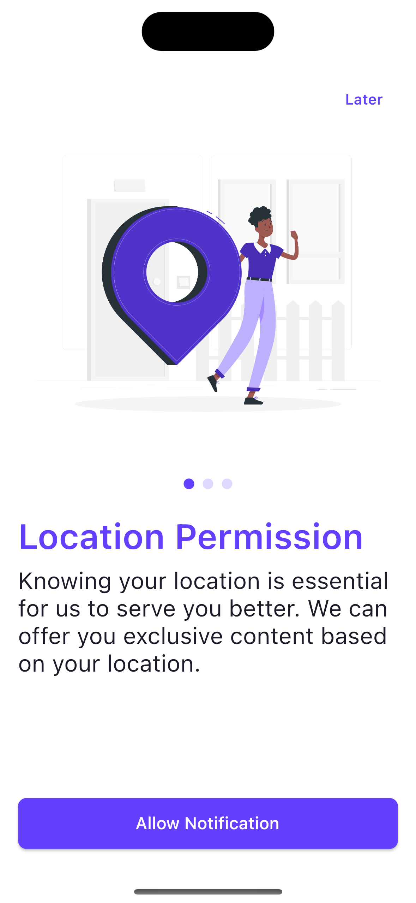
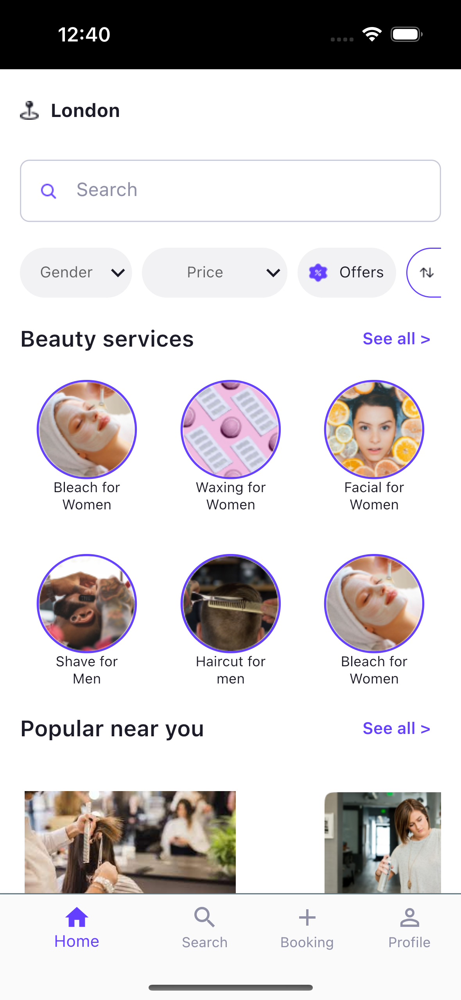
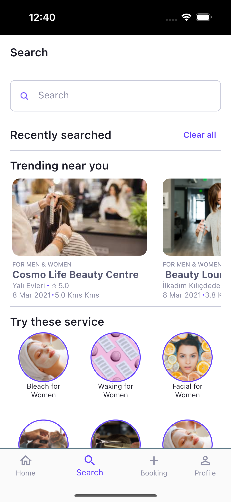
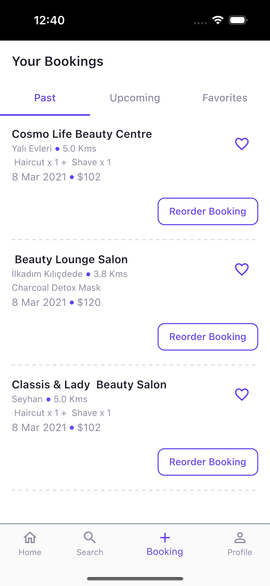
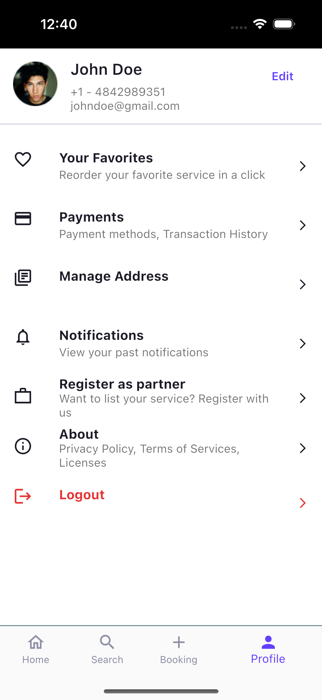

The framework used for this project is [Flutter](https://flutter.dev/). Flutter is an open-source mobile application development framework developed by Google. Flutter uses the [Dart](https://dart.dev/) programming language and provides developers with the ability to develop fast, modern, and performant mobile applications.

This application is designed for Flutter [SDK version](https://docs.flutter.dev/development/tools/sdk/releases) 2.18.5 and above, and uses packages such as [provider](https://pub.dev/packages/provider) for state management. Additionally, [flavor](https://pub.dev/packages/flavor) and [flutter_dotenv](https://pub.dev/packages/flutter_dotenv) packages are used to simplify configuration processes.

The [intl](https://pub.dev/packages/intl) package is used for localization purposes, while the [cupertino_icons](https://pub.dev/packages/cupertino_icons) package is used to create visual elements in the application.

For data storage, the application uses [shared_preferences](https://pub.dev/packages/shared_preferences) package, and tools such as [flutter_gen_runner](https://pub.dev/packages/flutter_gen_runner) and is used to facilitate data management. The [flutter_lints](https://pub.dev/packages/flutter_lints) package can also be used for different purposes during the application development process.

## Technologies Used

- **Framework:** [Flutter](https://flutter.dev/)
- **Language:** [Dart](https://dart.dev/)
- **SDK**: [2.18.5+](https://docs.flutter.dev/development/tools/sdk/releases)
- **State Management:**  [provider](https://pub.dev/packages/provider)
- **Configuration:** [flavor](https://pub.dev/packages/flavor), [flutter_dotenv](https://pub.dev/packages/flutter_dotenv)
- **Database:** [shared_preferences](https://pub.dev/packages/shared_preferences)
- **Database Management:**  [shared_preferences](https://pub.dev/packages/shared_preferences)
- **UI Elements:** [cupertino_icons](https://pub.dev/packages/cupertino_icons), [device_preview](https://pub.dev/packages/device_preview)
- **Package Management:** [flutter_gen_runner](https://pub.dev/packages/flutter_gen_runner)
- **Static Code Analysis:** [flutter_lints](https://pub.dev/packages/flutter_lints)


## Installation & Use

**Step 1:** Fork this project to your own warehouse:

```bash
git clone https://github.com/gurkanfikretgunak/template_team_app
```

**Step 2:** Open the project folder with VS Code or Android Studio and execute the following command to install the dependency package:

```bash
flutter pub get
```

**Step 3:** To run the project, set the main_dev.dart file in the lib/flavors folder as the run/debug configuration, and then you can start developing and debugging the project

## File Structer
```bash
📦app
┣ 📂l10n
┣ 📂routes
┗ 📂views
┃ ┣ 📂account
┃ ┣ 📂auth
┃ ┣ 📂beauty_service_detail
┃ ┣ 📂booking_detail
┃ ┣ 📂bookings
┃ ┣ 📂checkout
┃ ┣ 📂checkout_detail
┃ ┣ 📂filter_bottom_sheet
┃ ┣ 📂home
┃ ┣ 📂maps
┃ ┣ 📂navigation
┃ ┣ 📂onboarding
┃ ┣ 📂permission
┃ ┣ 📂promo
┃ ┣ 📂search
┃ ┣ 📂shop
┃ ┣ 📂shop_detail
┃ ┣ 📂splash
┣ 📂widgets
┃ ┣ 📂buttons
┃ ┣ 📂divider
┃ ┣ 📂image_viewer
┃ ┣ 📂inputs
┃ ┣ 📂list_items
┃ ┣ 📂system_ui_overlay
┃ ┣ 📂tabbar
┃ ┣ 📜custom_alert_dialog.dart  
┃ ┣ 📜custom_appbar.dart
┃ ┣ 📜custom_bottom_sheet.dart  
┃ ┣ 📜custom_card.dart
┃ ┣ 📜custom_show_snack_bar.dart  
┃ ┗ 📜custom_text.dart
┗ 📜app.dart


```

- "l10n" folder contains the localization files of the application, which enable the application to be used in different languages.
- "themes" folder contains the theme files of the application, which determine the look and feel of the application.
- "views" folder contains the different pages of the application. Each page is in a subfolder and contains the files of the components specific to that page.
- The "account" subfolder contains the components for the profile account page.
- The "auth" subfolder contains the components for the login page.
- The "beauty_service_detail" subfolder contains the components for the detail of services page.
- The "booking_detail" subfolder contains the components for the booking detail page.
- The "bookings" subfolder contains the components for the details page of bookings page.
- The "checkout" subfolder contains the components for the checkout page.
- The "checkout_detail" subfolder contains the components for the shopping detail page page.
- The "filter_bottom_sheet" subfolder contains the components for the bottom sheet to filter services.
- The "home" subfolder contains the components for the home page.
- The "maps" subfolder contains the components for the map page.
- The "navigation" subfolder contains the components for the bottom navigation bar page.
- The "onboarding" subfolder contains the components for the onboarding page.
- The "permission" subfolder contains the components for the app permissions confirmation page.
- The "search" subfolder contains the components for the service search page.
- The "shop" subfolder contains the components for the shop page.
- The "shop_detail" subfolder contains the components for the shop detail page.
- The "splash" subfolder contains the components for the splash page.
- The "app.dart" file is the main file of the application and allows the application to run.

```bash
📦core  
 ┣ 📂base 
 ┣ 📂config 
 ┣ 📂extensions
 ┣ 📂init  
 ┃ ┗ 📂theme
 ┣ 📂models  
 ┣ 📂provider 
 ┃ ┣ 📜multi_provider_init.dart  
 ┗ 📂utils  

```

This package is divided into various sub-packages, including data modeling, database operations, and other helper functions. The file structure includes:

"base: The part where the basis of the application is determined. The files "base_view", "navigation", "view_model".

"extensions: File created to call the most used features of the application by collecting them in one place. The files "common_extension.dart".

"model: This folder includes the classes used for data modeling in the application. The files "booking_model.dart". The ".g.dart" files are necessary for these classes to be automatically serialized using the "json_serializable" library.

utils: This folder contains various helper functions used throughout the application. The "constants" folder includes constants such as colors, sizes, and icons used in the application. 

This file structure can be used to organize the essential components of the application and provides data models and helper functions used throughout the project.

```bash
📦flavors  
 ┣ 📜main_dev.dart  
 ┗ 📜main_prod.dart
 ┗ 📜main_test.dart

```

The "flavors" folder provides the configurations and settings necessary for running the application in different environments.

The "main_dev.dart" and "main_prod.dart" files contain the main files of the application for development and QA (quality assurance) environments, respectively. These files include different configurations that allow the application to behave differently in different environments. These configurations may include environment-specific features such as server connections, logging levels, or test data.

```bash
📦gen  
 ┗ 📜assets.gen.dart
 
```

The "gen" folder contains various code generation tools for the project. The "assets.gen.dart" file provides constants for accessing files in the application's assets folder. These constants can be used anywhere in the application and can be made compatible with other libraries used to manage the application's assets.

## Packages

The aap is currently developed with the following packages.
Instructions on how to use them in your own application are linked below.

| Packages  | Description  | Resource  |
|--|--|--|
| cupertino_icons: ^1.0.5 |A Flutter package that includes icons from Apple's design language.| <https://pub.dev/packages/cupertino_icons/versions/1.0.2> |
| flutter_localizations / flutterintl: ^0.17.0 | A package that can be used for localization in Flutter applications. It enables customizing the application content according to different languages and cultures. | <https://pub.dev/packages/intl/versions/0.17.0-nullsafety.1> |
| provider: ^6.0.5 | It is an easy to use package which is basically a wrapper around the InheritedWidgets that makes it easier to use and manage. | <https://pub.dev/packages/provider>|
| mask_text_input_formatter: ^2.4.0 | The package provides TextInputFormatter for TextField and TextFormField which format the input by a given mask. | <https://pub.dev/packages/mask_text_input_formatter>|
| pin_code_fields: ^7.4.0 | A flutter package which will help you to generate pin code fields with beautiful design and animations. Can be useful for OTP or pin code inputs.|<https://pub.dev/packages/pin_code_fields> |
| logger: ^1.1.0 |Small, easy to use and extensible logger which prints beautiful logsInspired by logger for Android.| <https://pub.dev/packages/logger> |
| build_runner: ^2.3.3 |The build_runner package provides a concrete way of generating files using Dart code, outside of tools like pub. Unlike pub serve/build, files are always generated directly on disk, and rebuilds are incremental - inspired by tools such as Bazel. |<https://pub.dev/packages/build_runner>  |
| faker: ^2.1.0 | A library for Dart that generates fake data.| <https://pub.dev/packages/faker> |
| flutter_gen_runner: ^5.1.0+1 |The Flutter code generator for your assets, fonts, colors, … — Get rid of all String-based APIs.| <https://pub.dev/packages/flutter_gen_runner> |
| freezed_annotation: ^2.2.0 | Annotations for the freezed code-generator. This package does nothing without freezed too.|<https://pub.dev/packages/freezed_annotation>  |
| flavor: ^2.0.0 | A Flutter plugin for configuring flavor settings and optionally display a flavor banner on the app.|<https://pub.dev/packages/flavor>  |
| flutter_dotenv: ^5.0.2 |Load configuration at runtime from a .env file which can be used throughout the application. |<https://pub.dev/packages/flutter_dotenv>  |
| dot_navigation_bar: ^1.0.1+4 |A bottom navigation bar that you can customize with the options you need, without any limits. |<https://pub.dev/packages/dot_navigation_bar>  |
| buttons_tabbar: ^1.3.6 |Open source Flutter package, tabbar where each tab indicator is a toggle button. |<https://pub.dev/packages/buttons_tabbar>  |
| smooth_page_indicator: ^1.0.0+2 |Customizable animated page indicator with a set of built-in effects. | <https://pub.dev/packages/smooth_page_indicator> |
| url_launcher: ^6.1.8 |A Flutter plugin for launching a URL. | <https://pub.dev/packages/url_launcher> |
| share_plus: ^6.3.0 |A Flutter plugin to share content from your Flutter app via the platform's share dialog. | <https://pub.dev/packages/share_plus> |
| map_launcher: ^2.4.0 |Map Launcher is a flutter plugin to find available maps installed on a device and launch them with a marker or show directions. |<https://pub.dev/packages/map_launcher>  |
| shared_preferences: ^2.0.17 |Flutter plugin for reading and writing simple key-value pairs. Wraps NSUserDefaults on iOS and SharedPreferences on Android. | <https://pub.dev/packages/shared_preferences> |
| cached_network_image: ^3.2.3 | A flutter library to show images from the internet and keep them in the cache directory.|<https://pub.dev/packages/cached_network_image>  |
| permission_handler: ^10.2.0|Permission plugin for Flutter. This plugin provides a cross-platform (iOS, Android) API to request and check permissions. |<https://pub.dev/packages/permission_handler>  |


## Screenshot

|Splash View | Onboarding View  |
|--|--|
|  | 
| A splash view is a transition screen that appears when the application is launched and contains the logo of the application. | Onboarding view, also known as a welcome screen, is a crucial component of a mobile app's user experience that aims to introduce new users to the app's features and functionality.  |


|Sign In View  | Permission View |
|--|--|
| )| 
| Sign In view is a critical component of a mobile app that allows users to securely access their account and personalized content. | Permission view is a user interface element in a mobile app that requests users' permission to access certain device resources or data, such as the camera, microphone, location, contacts, or storage. |


|Home View  | Search View|
|--|--|
| | 
| Home view, also known as the main screen or landing page, is a primary user interface element in a mobile app that provides users with quick access to the app's main features, content, and navigation. | Search view is a user interface element in a mobile app that allows users to search for specific content or information within the app. |


|Booking View  | Profile View |
|--|--|
| | 
| Booking view is a user interface element in a mobile app that allows users to book and manage appointments or reservations, such as for travel, dining, or healthcare services. | Profile view is a user interface element in a mobile app that allows users to view and manage their personal information, preferences, and settings.  |


## Contributors
- [Gürkan Fikret Günak](https://github.com/gurkanfikretgunak)
- [Ayşenur Perker](https://github.com/aysenurperker1)
- [Elif Karagöz](https://github.com/eliffkaragoz)
- [Melih Çelik](https://github.com/melihcelik09)
- [Mete Çoban](https://github.com/metecoban)

### Special Thanks to 
Thanks for preparing the README draft as per the requirements.

- [Ali Özten](https://github.com/aliozten92)
